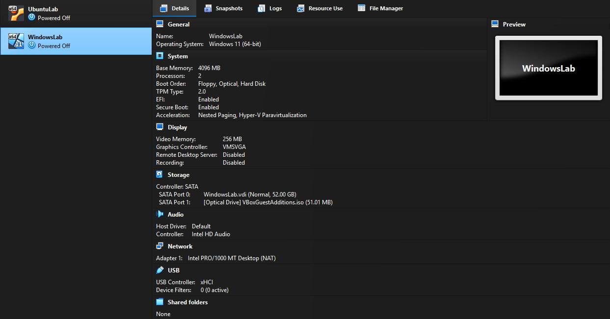

# 🖥️ Virtual Cybersecurity Home Lab

## Overview

I created a virtual cybersecurity home lab using **Oracle VirtualBox** to provide a safe environment for practicing Windows, Linux, networking, system hardening, firewall configuration, and security analysis.

My lab includes two virtual machines:

| Virtual Machine | Operating System | Purpose |
| --- | --- | --- |
| **WindowsLab** | Windows | Windows administration, networking, firewall analysis, and security configuration |
| **UbuntuLab** | Ubuntu Linux | Linux administration, command-line practice, hardening, firewall analysis, and security testing |

Using virtual machines allows me to practice security tasks without making unnecessary changes to my primary computer.

---

## 🔬 Virtual Lab Configuration

My cybersecurity home lab contains both a Windows virtual machine (`WindowsLab`) and an Ubuntu Linux virtual machine (`UbuntuLab`) running in Oracle VirtualBox.

The two operating systems allow me to practice security concepts across different environments, including Windows administration, Linux command-line operations, networking, firewall configuration, system hardening, and security auditing.

### WindowsLab

`WindowsLab` provides my Windows environment for networking and security exercises. I have used this environment to examine IP configuration, connectivity, DNS resolution, ARP information, routing, open ports, and Windows firewall rules.

*Figure 1. WindowsLab virtual machine configured in Oracle VirtualBox for cybersecurity practice.*

### UbuntuLab

`UbuntuLab` provides my Linux environment for practicing command-line administration and system security.

I used the Ubuntu system to perform a Linux hardening audit covering privileged accounts, file permissions, sudo access, local accounts, SSH, firewall status, SUID files, system updates, and password-expiration settings.

📸 **UbuntuLab screenshot will be added here.**

---

## 🌐 Windows Network Configuration

As part of my networking lab, I examined the Windows network configuration and recorded the following:

| Setting | Result |
| --- | --- |
| IPv4 Address | `10.0.2.15` |
| Subnet Mask | `255.255.255.0` |
| Default Gateway | `10.0.2.2` |

I also identified DNS information and successfully tested connectivity to the gateway at `10.0.2.2`.

### DNS, ARP, and Routing

I performed additional networking exercises involving DNS resolution, ARP, and routing. The lab recorded **7 devices in the ARP table** and `10.0.2.2` in the routing results.

I also performed DNS resolution tests for Google and Microsoft. These exercises helped me practice identifying how systems locate other devices, resolve domain names, and determine where network traffic should be sent.

### Open Port Identification

I examined listening network ports and recorded the following result:

| Property | Result |
| --- | --- |
| Address/Port | `0.0.0.0:445` |
| State | Listening |
| PID | `552` |

Identifying listening ports is useful when evaluating a system's network exposure. A listening port can then be investigated to determine which service is using it and whether that service is required.

---

## 🐧 Linux Privileged Account Review

One of my Ubuntu security checks involved identifying accounts with UID 0, which represents root-level privileges.

I ran:

    awk -F: '$3 == 0 {print $1}' /etc/passwd

The command returned only the `root` account. No additional UID 0 accounts were identified.

This check helped me understand how Linux account information can be reviewed for unexpected privileged access.

📸 **UID 0 screenshot will be added here.**

---

## 🔐 Linux File Permission Review

I checked the Ubuntu system for files with `777` permissions using:

    find / -type f -perm 777 2>/dev/null

The command returned no results, meaning no files with `777` permissions were identified during the audit.

I also reviewed `/etc/shadow`. The recorded permissions were:

    -rw-r-----

My audit documented that the file was not world-readable, helping protect the stored password hashes from unauthorized access.

📸 **File-permission screenshot will be added here.**

---

## 👤 Linux Administrative Access

I reviewed the Linux `sudo` group to identify accounts with administrative privileges.

My audit found several accounts listed as members of the sudo group. Because these accounts can perform administrative actions, my security recommendation was that this access should remain limited to authorized users.

This exercise reinforced the importance of the **Principle of Least Privilege** when managing Linux systems.

📸 **Sudo-group screenshot will be added here.**

---

## 🔑 SSH Security Review

I attempted to review the Ubuntu SSH configuration using:

    grep "^PermitRootLogin" /etc/ssh/sshd_config

The configuration file was not available because OpenSSH Server was not installed on the Ubuntu system. Therefore, SSH was not enabled, and remote root login through SSH was not possible in that lab configuration.

This demonstrated that security auditing does not always produce an expected configuration. The existing state of a system should be documented accurately rather than changed simply to produce a particular result.

📸 **SSH screenshot will be added here.**

---

## 🛡️ Ubuntu Firewall Review

At the time of my original Linux hardening audit, I checked UFW using:

    sudo ufw status

The firewall was reported as **inactive**.

My recommendation was to enable UFW and review its rules so that only necessary network connections would be allowed.

This finding gave me an example of how a security audit can identify a configuration that may require improvement.

📸 **UFW screenshot will be added here.**

---

## ⚙️ Linux SUID File Review

I searched for files with the SUID permission using:

    find / -perm -4000 -type f 2>/dev/null

Several SUID files were identified. My audit documented them as expected system utilities that require elevated privileges to perform particular tasks.

The exercise helped me understand why privileged executables should be reviewed as part of a Linux security audit.

---

## 🔄 Linux Update Review

I checked for available Ubuntu package updates using:

    sudo apt list --upgradable

The system returned several available updates, indicating that some packages were outdated.

This demonstrated the importance of patch management because outdated software can leave known security weaknesses unresolved.

📸 **System-update screenshot will be added here.**

---

## 🧰 Skills Demonstrated

- Virtualization
- Windows Administration
- Linux Administration
- Linux Command Line
- IPv4 Networking
- DNS
- ARP
- Routing
- Connectivity Testing
- Port Analysis
- Linux File Permissions
- Privileged Account Auditing
- Sudo Access Review
- SSH Configuration Review
- Firewall Auditing
- SUID Analysis
- Patch Management
- System Hardening

---

## 🚀 How the Lab Supports My Cybersecurity Development

This home lab serves as the technical foundation for several projects in my cybersecurity portfolio.

Instead of only learning concepts theoretically, I can use Windows and Ubuntu systems to perform security checks, review configurations, execute administrative commands, investigate findings, and document evidence.

The environment can also continue to grow as I progress into more advanced areas of cybersecurity.

---

## Conclusion

Building and working with Windows and Ubuntu virtual environments has provided me with practical experience across multiple operating systems.

The lab has allowed me to practice networking, Linux administration, Windows administration, system auditing, permissions analysis, patch management, firewall review, and security hardening in a controlled environment.

It also provides a foundation for future hands-on work as I continue developing my cybersecurity and digital forensics skills.
