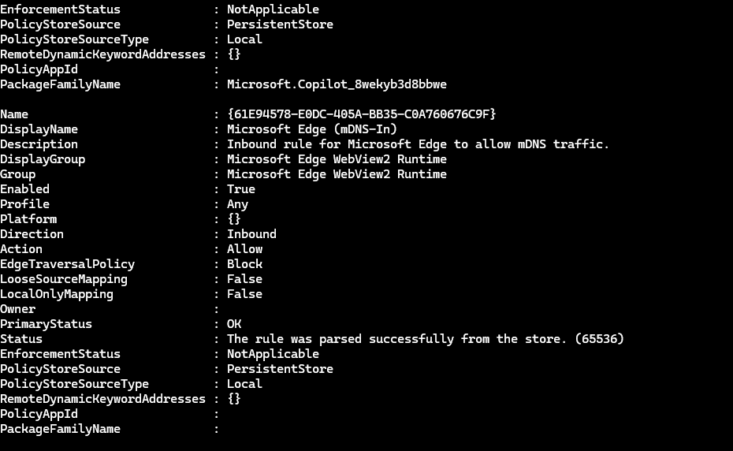
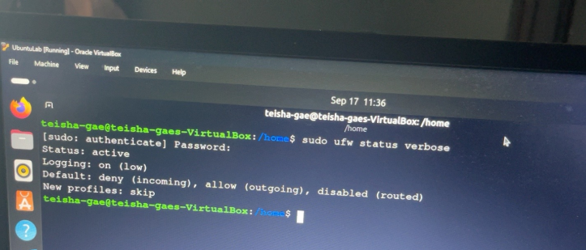

# 🔥 Firewall Rules & Network Defense Audit

## Overview

This project documents a firewall and network-defense audit performed across my **Windows** and **Ubuntu Linux** virtual lab environments.

The purpose of the audit was to examine existing firewall configurations, identify potentially unnecessary network exposure, evaluate inbound and outbound traffic controls, and apply the security principles of **Least Privilege** and **Defense in Depth**.

The audit included:

- Windows Defender Firewall rule analysis
- Inbound and outbound rule review
- Network-profile analysis
- Ubuntu UFW status review
- Default firewall-policy review
- Network exposure analysis
- Firewall hardening recommendations

---

## 🧪 Lab Environment

| System | Firewall Technology | Audit Focus |
| --- | --- | --- |
| WindowsLab | Windows Defender Firewall | Rules, direction, action, and network profiles |
| UbuntuLab | UFW | Firewall status, default policies, and configured rules |

Both systems operate within my Oracle VirtualBox cybersecurity home lab.

---

# 🪟 Windows Defender Firewall Audit

I used PowerShell to review firewall rules configured on the Windows system.

### Command

    Get-NetFirewallRule

The audit allowed me to examine firewall properties including:

- Rule name
- Enabled status
- Direction
- Action
- Network profile

*Figure 1. Windows Defender Firewall rule output reviewed using PowerShell, showing an enabled inbound rule and its associated network profile and action.*

---

## Windows Firewall Rules Reviewed

Examples of rules reviewed during the audit included:

| Firewall Rule | Direction | Action | Profile |
| --- | --- | --- | --- |
| Wi-Fi Direct Spooler Use (Out) | Outbound | Allow | Public |
| Network Discovery SSDP-Out | Outbound | Allow | Private |
| Network Discovery WSD Events-Out | Outbound | Allow | Private |
| Wi-Fi Direct Spooler Use (In) | Inbound | Allow | Public |
| Remote Assistance TCP-Out | Outbound | Allow | Domain/Private |
| Core Networking Packet Too Big ICMPv6-Out | Outbound | Allow | Any |

Reviewing individual rules helped me understand that firewall security involves more than simply determining whether the firewall is enabled.

Each rule should be evaluated according to:

- What traffic it permits
- Whether the traffic is inbound or outbound
- Which network profiles are affected
- Whether the associated service is required

---

## 🔎 Windows Security Finding

One rule that required additional attention was:

**Wi-Fi Direct Spooler Use (In)**

The rule allowed **inbound traffic** while using the **Public** network profile.

Public networks are generally less trusted than private or domain networks. Because of this, inbound rules that apply to the Public profile should be reviewed carefully.

### Recommendation

Verify whether the service is required.

If it is not needed, the rule should be disabled or restricted according to the system's operational requirements.

This follows the **Principle of Least Privilege** by reducing unnecessary network access.

---

# 🐧 Ubuntu UFW Audit

I also reviewed the firewall configuration of my Ubuntu virtual machine using **UFW (Uncomplicated Firewall)**.

### Firewall Status

I used:

    sudo ufw status

The firewall reported:

    Status: active

*Figure 2. Ubuntu UFW firewall configuration showing the active firewall status and default traffic policies.*

This confirmed that the Ubuntu host-based firewall was enabled during the later firewall audit.

---

## UFW Default Policies

The firewall configuration reviewed during the exercise documented the following policies:

| Setting | Configuration |
| --- | --- |
| Firewall Status | Active |
| Logging | On (low) |
| Incoming Traffic | Deny |
| Outgoing Traffic | Allow |
| Routed Traffic | Disabled |

The **default-deny incoming policy** is particularly important because unsolicited inbound connections are blocked unless they are specifically permitted.

This reduces unnecessary network exposure.

---

## UFW Numbered Rules

I also reviewed manually configured UFW rules.

### Command

    sudo ufw status numbered

No manually configured numbered rules were present during the review.

📸 **UFW numbered-rule screenshot will be added here.**

This means the firewall was primarily relying on its configured default policies rather than additional manually created allow or deny rules.

---

# 🌐 Network Defense Analysis

A firewall is an important defensive control, but it should not be considered complete protection by itself.

For example, services listening on network ports can increase a system's attack surface.

In my networking lab, I identified a Windows system listening on:

    0.0.0.0:445

TCP port **445** is commonly associated with SMB network services.

This type of network exposure demonstrates why unnecessary services and firewall permissions should be reviewed carefully.

---

## 🦠 Threat Context: WannaCry

The WannaCry ransomware outbreak demonstrated the risks associated with vulnerable SMB services.

This provides useful context for understanding why network services such as SMB should be:

- Properly patched
- Securely configured
- Restricted when unnecessary
- Protected by appropriate firewall rules
- Monitored for suspicious activity

A firewall can reduce network exposure, but patching remains essential because firewall protection alone does not correct vulnerabilities in the underlying service.

---

# 🛡️ Defense in Depth

Effective network security requires multiple protective controls working together.

Examples include:

- Host-based firewalls
- Security patching
- Secure system configuration
- Strong authentication
- Least-privilege access
- Network monitoring
- Account security
- Vulnerability management
- Incident response

If one defensive layer fails, another layer may still reduce the likelihood or impact of compromise.

---

## Principle of Least Privilege

Least Privilege also applies to network traffic.

A system should only permit the connections required for legitimate operation.

Firewall rules should therefore be reviewed to determine whether:

- The service is still required
- The rule needs inbound access
- The rule needs to apply to all network profiles
- The scope can be restricted
- An unnecessary rule can be disabled

---

## 🔎 Key Audit Findings

| Area | Finding | Recommendation |
| --- | --- | --- |
| Windows Firewall | Existing inbound and outbound rules were identified | Continue periodic firewall-rule reviews |
| Public Profile | An inbound Wi-Fi Direct Spooler rule applied to Public networks | Verify need and disable or restrict if unnecessary |
| Ubuntu Firewall | UFW was active | Maintain host-based firewall protection |
| Ubuntu Incoming Traffic | Default incoming policy was deny | Maintain restrictive inbound policy |
| Ubuntu Outgoing Traffic | Default outgoing policy was allow | Review if application-specific restrictions become necessary |
| UFW Manual Rules | No numbered manual rules were present | Add only rules required for legitimate services |
| Network Exposure | TCP port 445 was identified as listening in the Windows networking lab | Confirm SMB is required and maintain patching and firewall protection |

---

## 🔧 Hardening Recommendations

Based on the audit, recommended firewall and network-defense practices include:

1. Maintain host-based firewalls on Windows and Linux systems.
2. Use restrictive default inbound policies where appropriate.
3. Periodically review enabled firewall rules.
4. Disable rules associated with services that are no longer required.
5. Carefully review inbound rules that apply to Public networks.
6. Keep operating systems and network services patched.
7. Monitor listening ports and investigate unexpected services.
8. Apply the Principle of Least Privilege to network access.
9. Combine firewall protection with other defensive security controls.
10. Document firewall changes to support future audits and investigations.

---

## 🧰 Skills Demonstrated

- Windows Defender Firewall
- Ubuntu UFW
- PowerShell
- Linux Command Line
- Firewall Rule Analysis
- Inbound and Outbound Traffic Analysis
- Network Profile Analysis
- Port Analysis
- SMB Security Awareness
- Network Hardening
- Principle of Least Privilege
- Defense in Depth
- Security Auditing
- Risk Identification
- Security Recommendations
- Technical Documentation

---

## 📁 Related Portfolio Work

This audit connects with other projects in my cybersecurity portfolio, including:

- Virtual Cybersecurity Home Lab
- Windows & Linux System Hardening
- Linux Hardening Checklist
- Incident Response Quick Guide
- SSH Authentication Log Investigation

Together, these projects demonstrate how system configuration, network defense, access control, monitoring, and incident response contribute to a layered cybersecurity strategy.

---

## Conclusion

This firewall audit provided practical experience reviewing network-defense controls across both Windows and Linux systems.

The exercise demonstrated that an enabled firewall is only the starting point. Effective firewall management requires reviewing individual rules, understanding network profiles, evaluating listening services, and determining whether permitted traffic is actually necessary.

By combining firewall controls with patching, secure configuration, monitoring, and least-privilege access, systems can be better protected through a Defense in Depth approach.
