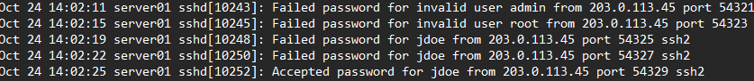

# 🔎 SSH Authentication Log Investigation

## Overview

This project documents the analysis of a Linux authentication log to investigate suspicious SSH activity and reconstruct a sequence of security-relevant events.

The investigation focused on identifying:

- Failed SSH authentication attempts
- Successful authentication
- Source IP activity
- Privileged commands
- Account creation
- Changes to administrative privileges
- Session activity
- Potential impact on confidentiality, integrity, and availability

The investigation demonstrates how authentication logs can be used to build an evidence-based timeline without making conclusions beyond what the available evidence supports.

---

# 📁 Evidence Source

The primary evidence source was a Linux authentication log:

    auth.log

The log contained SSH authentication events, sudo activity, account-management commands, and session information.

A source IP associated with the SSH authentication activity was:

    203.0.113.45

---

# 🕒 Investigation Timeline

| Time | Event | Analysis |
| --- | --- | --- |
| 14:02:11 | Failed SSH login for invalid user `admin` | Unsuccessful authentication attempt |
| 14:02:15 | Failed SSH login for invalid user `root` | Additional unsuccessful authentication attempt |
| 14:02:19 | Failed SSH login for `jdoe` | Attempt against an existing account |
| 14:02:22 | Second failed SSH login for `jdoe` | Repeated authentication attempt |
| 14:02:25 | Successful SSH login for `jdoe` | Authentication succeeded after multiple failures |
| 14:03:01 | Root CRON session opened and closed | System activity recorded after login; this event alone does not establish malicious activity |
| 14:04:12 | `jdoe` used sudo to access `/etc/shadow` | Privileged access to sensitive account information |
| 14:06:33 | `jdoe` used sudo to create `sysadmin` and add the account to the sudo group | Administrative account and privilege modification |
| 14:08:05 | SSH session closed | End of recorded SSH session |

---

# 🔐 Authentication Analysis

The log showed several unsuccessful SSH authentication attempts before a successful login.

The sequence included attempts involving:

    admin
    root
    jdoe

The `jdoe` account experienced two failed authentication attempts before a successful login was recorded.

*Figure 1. Authentication log showing multiple failed SSH login attempts followed by successful authentication for the `jdoe` account.*

This sequence is security-relevant because repeated authentication failures followed by a successful login can warrant further investigation.

However, the log alone does not prove who physically controlled the account or entered the successful credentials.

---

# 🚨 Post-Authentication Activity

After successful authentication, additional activity involving the `jdoe` account was recorded.

At approximately **14:04:12**, the account used elevated privileges to access:

    /etc/shadow

The `/etc/shadow` file contains sensitive Linux account and password-related information and is normally protected from ordinary users.

Later, at approximately **14:06:33**, privileged commands associated with `jdoe` created an account named:

    sysadmin

The new account was then added to the:

    sudo

group.

📸 **Privileged activity log screenshot will be added here.**

Creating an account and granting it sudo access is a significant security event because sudo membership can provide administrative capabilities.

---

# 🔎 Key Findings

## Finding 1 — Multiple Failed SSH Attempts

Several failed SSH authentication attempts occurred within a short period.

This included attempts involving invalid usernames and the `jdoe` account.

### Security Significance

Repeated failed authentication attempts may indicate:

- Incorrect credentials
- Automated login attempts
- Password guessing
- Unauthorized access attempts

The log should be interpreted alongside other available evidence before attributing intent.

---

## Finding 2 — Successful Authentication

A successful SSH authentication for `jdoe` occurred after the failed attempts.

### Security Significance

The transition from repeated failures to successful authentication makes the event worth investigating further.

Additional evidence could help determine whether the authentication was legitimate, including:

- Normal login history
- Device information
- Additional system logs
- User activity
- Network records
- Account ownership information

---

## Finding 3 — Privileged Access to `/etc/shadow`

The `jdoe` account later used sudo privileges to access:

    /etc/shadow

### Security Significance

Access to this file is sensitive because it contains protected authentication information.

Privileged access to security-sensitive files should be monitored and reviewed when investigating suspicious activity.

---

## Finding 4 — Administrative Account Creation

The log recorded activity associated with the creation of:

    sysadmin

The account was subsequently added to the sudo group.

### Security Significance

Creating a new privileged account can provide continued administrative access to a system.

This activity should therefore be validated against authorized administrative changes.

---

## Finding 5 — CRON Activity

A root CRON session was recorded at approximately **14:03:01**.

### Security Significance

CRON is commonly used by Linux systems to execute scheduled tasks.

The presence of a root CRON event alone is **not sufficient evidence of malicious activity**.

Additional evidence would be required before connecting the event to the suspicious SSH activity.

---

# 🧠 Evidence-Based Interpretation

An important part of digital investigation is separating **what the evidence shows** from **what the investigator suspects**.

The available log supports the conclusion that:

- Multiple SSH authentication failures occurred.
- A successful authentication for `jdoe` followed.
- Privileged activity was associated with the `jdoe` account.
- `/etc/shadow` was accessed using elevated privileges.
- A `sysadmin` account was created.
- The new account was granted sudo privileges.
- The SSH session later closed.

The log does **not**, by itself, establish who was physically operating the account or whether the legitimate account owner performed the actions.

Additional evidence would be required for attribution.

---

# 🔺 CIA Triad Impact

## Confidentiality

**Potentially at risk**

Privileged access to `/etc/shadow` involved sensitive authentication information.

Unauthorized access to protected authentication data could affect confidentiality.

---

## Integrity

**Affected**

The creation of a new account and modification of sudo-group membership changed the system's account and privilege configuration.

These actions represent changes to system state.

---

## Availability

**No direct impact identified from the available log**

The reviewed evidence did not show system shutdown, service disruption, resource exhaustion, or another clear availability-related event.

This does not prove that no availability impact occurred elsewhere; it only reflects the evidence reviewed in this investigation.

---

# 🛡️ Recommended Security Controls

Based on the activity reviewed, useful defensive measures include:

1. Enable multi-factor authentication where supported.
2. Monitor repeated SSH authentication failures.
3. Alert on unusual successful logins following repeated failures.
4. Review sudo activity and privileged commands.
5. Monitor creation of new local accounts.
6. Alert when accounts are added to administrative groups.
7. Apply the Principle of Least Privilege.
8. Restrict unnecessary remote access.
9. Preserve authentication and system logs.
10. Correlate authentication logs with network and endpoint evidence during investigations.

---

# 📋 Additional Evidence to Collect

To continue the investigation, I would look for:

- SSH service logs
- Login history
- Sudo logs
- Shell history
- Account creation records
- File access information
- Network connection logs
- Firewall logs
- Endpoint security alerts
- System timestamps
- Other activity associated with the source IP

Using multiple evidence sources would provide stronger context than relying on a single log.

---

# 🔗 Timeline Correlation

Individual log entries may appear insignificant when viewed separately.

When arranged chronologically, however, the sequence becomes more useful:

**Failed Logins → Successful Authentication → Privileged File Access → Account Creation → Administrative Privilege Change → Session Closed**

Timeline reconstruction helps investigators understand relationships between events while avoiding unsupported assumptions.

---

# 🧰 Skills Demonstrated

- Linux Authentication Log Analysis
- SSH Security Analysis
- Security Event Timeline Reconstruction
- Failed Login Analysis
- Privileged Activity Review
- Linux Account Security
- Sudo Activity Analysis
- Digital Evidence Interpretation
- CIA Triad Analysis
- Incident Investigation
- Evidence-Based Reporting
- Security Control Recommendations
- Principle of Least Privilege
- Technical Documentation

---

# 📁 Related Portfolio Work

This investigation connects with other projects in my cybersecurity portfolio, including:

- Virtual Cybersecurity Home Lab
- Linux Hardening Checklist
- Windows & Linux System Hardening
- Firewall Rules & Network Defense Audit
- Incident Response Quick Guide

These projects demonstrate the progression from configuring and protecting systems to detecting, investigating, and documenting suspicious activity.

---

# Conclusion

This investigation demonstrates how authentication logs can be used to reconstruct security events and identify activity requiring further investigation.

The most significant sequence involved repeated authentication failures, successful access through the `jdoe` account, privileged access to `/etc/shadow`, and the creation of a new sudo-enabled account.

The exercise also reinforced an important digital-forensics principle: investigators should report what the evidence supports while clearly distinguishing confirmed events from assumptions about identity, intent, or attribution.
